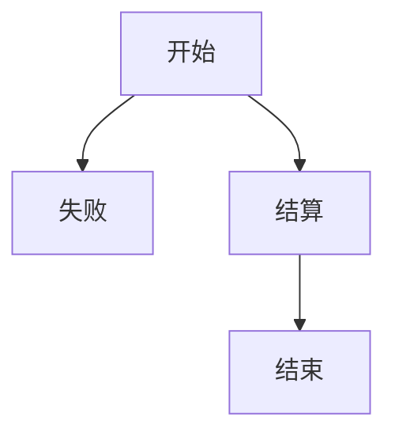

### 使用方法

> taskloop 是你要循环的次数
>
> nodes 是你这个循环中的所有节点
>
> 每个node下的child是它可到达的节点
>
> 目前解析玩这个结构是dag来进行存储的，虽然目前无法根据父节点来直接判断可到子节点，但实现了一些函数达到了伪B+树的效果
>
> 在不开启视频监控时，可以当作B+树来看，遍历方式是层序遍历
>
> 目前例子经过解析将会呈现这个结构




```yaml
 # 单个配置
 # win_title
  - task: "主账号"
    # 循环次数 默认10
    taskloop: 10
    nodes:
      # 任务事件名
      - node: "开始"
        # 处理策略 点击策略 和 按键策略
        strategy:
          type: "ClickStrategy"
                    # 点击处理 CENTER：匹配中心 RANDOM：匹配区域随机点 WITHOUT：不点击匹配区域 默认CENTER 可以忽略
          policy: "CENTER"
          # 偏移量 可以忽略 默认不偏移
          offset:
            x: 0
            y: 0
          # 鼠标按键 left right 可以忽略 默认左键点击
          button: "left"
#        strategy:
#          type: "InputStrategy"
#          # 可以忽略 默认ESC
#          key: "esc"
        # 匹配规则 template（value为模板名称） Ocr（value为需要匹配的文字，如果匹配有多个只会处理第一个）
        match_rule:
          type: "template"
          value: "action"
          # 置信度 默认0.9
          threshold: 0.9
        match_rule:
     	  type: "ocr"
	      value: "开始"
	      threshold: 0.9
        child:
          - node: "失败"
            strategy:
              type: "ClickStrategy"
            match_rule:
              type: "template"
              value: "end"
          - node: "结算"
            strategy:
              type: "ClickStrategy"
            match_rule:
              type: "template"
              value: "end"
            child:
              - node: "结束"
                strategy:
                  type: "ClickStrategy"
                match_rule:
                  type: "template"
                  value: "end"
```

### 样例

```yaml
# 脚本参数 目前只能处理简单逻辑 如果想处理回调之类的 目前是不支持的 后续打算提供接口 然后写lua来进行客制化处理
tasks:
  # win_title
  - task: "主账号"
    # 循环次数 默认10
    taskloop: 10
    nodes:
      # 任务事件名
      - node: "开始"
        # 处理策略 点击策略 和 按键策略
        strategy:
          type: "ClickStrategy"
                    # 点击处理 CENTER：匹配中心 RANDOM：匹配区域随机点 WITHOUT：不点击匹配区域 默认CENTER 可以忽略
          policy: "CENTER"
          # 偏移量 可以忽略 默认不偏移
          offset:
            x: 0
            y: 0
          # 鼠标按键 left right 可以忽略 默认左键点击
          button: "left"
#        strategy:
#          type: "InputStrategy"
#          # 可以忽略 默认ESC
#          key: "ESC"
        # 匹配规则 template（value为模板名称） Ocr（value为需要匹配的文字，如果匹配有多个只会处理第一个）
        match_rule:
          type: "template"
          value: "action"
          # 置信度 默认0.9
          threshold: 0.9
        child:
          - node: "失败"
            strategy:
              type: "ClickStrategy"
            match_rule:
              type: "template"
              value: "end"
          - node: "结算"
            strategy:
              type: "ClickStrategy"
            match_rule:
              type: "template"
              value: "end"
            child:
              - node: "结束"
                strategy:
                  type: "ClickStrategy"
                match_rule:
                  type: "template"
                  value: "end"
  #    match_rule:
  #      type: "ocr"
  #      value: "开始"
  - task: "副账号"
    # 这个是最简短配置
    nodes:
      # 任务事件名
      - node: "开始"
        # 处理策略 点击策略 和 按键策略
        strategy:
          type: "ClickStrategy"
        match_rule:
          type: "template"
          value: "action"
        child:
          - node: "结束"
            strategy:
              type: "ClickStrategy"
            match_rule:
              type: "template"
              value: "end"


```
### InputStrategy 支持的参数
```python
['\t', '\n', '\r', ' ', '!', '"', '#', '$', '%', '&', "'", '(',
')', '*', '+', ',', '-', '.', '/', '0', '1', '2', '3', '4', '5', '6', '7',
'8', '9', ':', ';', '<', '=', '>', '?', '@', '[', '\\', ']', '^', '_', '`',
'a', 'b', 'c', 'd', 'e','f', 'g', 'h', 'i', 'j', 'k', 'l', 'm', 'n', 'o',
'p', 'q', 'r', 's', 't', 'u', 'v', 'w', 'x', 'y', 'z', '{', '|', '}', '~',
'accept', 'add', 'alt', 'altleft', 'altright', 'apps', 'backspace',
'browserback', 'browserfavorites', 'browserforward', 'browserhome',
'browserrefresh', 'browsersearch', 'browserstop', 'capslock', 'clear',
'convert', 'ctrl', 'ctrlleft', 'ctrlright', 'decimal', 'del', 'delete',
'divide', 'down', 'end', 'enter', 'esc', 'escape', 'execute', 'f1', 'f10',
'f11', 'f12', 'f13', 'f14', 'f15', 'f16', 'f17', 'f18', 'f19', 'f2', 'f20',
'f21', 'f22', 'f23', 'f24', 'f3', 'f4', 'f5', 'f6', 'f7', 'f8', 'f9',
'final', 'fn', 'hanguel', 'hangul', 'hanja', 'help', 'home', 'insert', 'junja',
'kana', 'kanji', 'launchapp1', 'launchapp2', 'launchmail',
'launchmediaselect', 'left', 'modechange', 'multiply', 'nexttrack',
'nonconvert', 'num0', 'num1', 'num2', 'num3', 'num4', 'num5', 'num6',
'num7', 'num8', 'num9', 'numlock', 'pagedown', 'pageup', 'pause', 'pgdn',
'pgup', 'playpause', 'prevtrack', 'print', 'printscreen', 'prntscrn',
'prtsc', 'prtscr', 'return', 'right', 'scrolllock', 'select', 'separator',
'shift', 'shiftleft', 'shiftright', 'sleep', 'space', 'stop', 'subtract', 'tab',
'up', 'volumedown', 'volumemute', 'volumeup', 'win', 'winleft', 'winright', 'yen',
'command', 'option', 'optionleft', 'optionright']
```