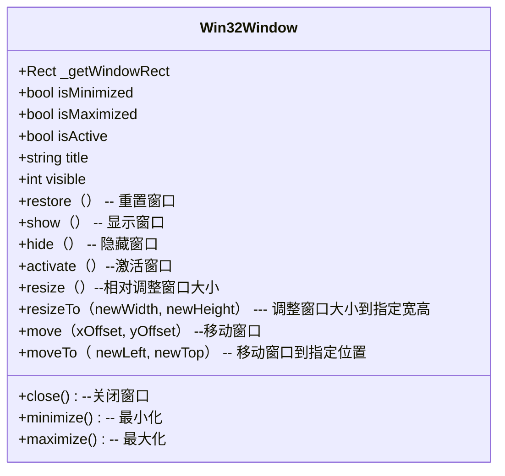

### pyautogui

|                      | 作用                                                         | 例子                                                         |
| -------------------- | ------------------------------------------------------------ | ------------------------------------------------------------ |
| screenshot           | 截图                                                         | pyautogui.screenshot([^screenshot_path]screenshot_path, [^region]region) |
| click                | 模拟鼠标点击                                                 | pyautogui.click(([^point]point), button='left')              |
| size                 | 获取屏幕宽高                                                 | pyautogui.size()                                             |
| press                | 模拟键盘输入                                                 | pyautogui.press([^key]key)                                   |
| getWindowsWithTitle  | 根据窗口标题进行选择，返回一个[^Win32Window]Win32Window对象的集合 | pyautogui.getWindowsWithTitle('[^title_name]title_name')     |
| getActiveWindow      | 得到当前鼠标焦点的窗口对象，[^Win32Window]Win32Window        | pyautogui.getActiveWindow（）                                |
| getActiveWindowTitle | 得到当前鼠标焦点的窗口标题                                   | pyautogui.getActiveWindowTitle()                             |
| getWindowsAt         | 得到在指定坐标的[^Win32Window]Win32Window对象的集合          | pyautogui.getWindowsAt（[^point]point）                      |
| getAllTitles         | 得到所有title                                                | pyautogui.getAllTitles()                                     |
| getAllWindows        | 得到所有可见Windows                                          | pyautogui.getAllWindows()                                    |
| cursor               | 得到当前鼠标的坐标                                           | pyautogui.cursor()                                           |
| resolution           | 获取屏幕宽高                                                 | pyautogui.resolution()                                       |
| imread               | 读取图片                                                     | cv2.imread([^path]path)                                      |
| imwrite              | 保存图片                                                     | cv2.imwrite([^path]path, [^img]img)                          |
| imencode             | 保存图片（解决中文乱码）                                     | cv2.imencode('.png', img)[1].tofile([^path]path)             |
| resize               | 调整图片大小                                                 | cv2.resize(img, (img.shape[1], img.shape[0]))                |


```
['\t', '\n', '\r', ' ', '!', '"', '#', '$', '%', '&', "'", '(',
')', '*', '+', ',', '-', '.', '/', '0', '1', '2', '3', '4', '5', '6', '7',
'8', '9', ':', ';', '<', '=', '>', '?', '@', '[', '\\', ']', '^', '_', '`',
'a', 'b', 'c', 'd', 'e','f', 'g', 'h', 'i', 'j', 'k', 'l', 'm', 'n', 'o',
'p', 'q', 'r', 's', 't', 'u', 'v', 'w', 'x', 'y', 'z', '{', '|', '}', '~',
'accept', 'add', 'alt', 'altleft', 'altright', 'apps', 'backspace',
'browserback', 'browserfavorites', 'browserforward', 'browserhome',
'browserrefresh', 'browsersearch', 'browserstop', 'capslock', 'clear',
'convert', 'ctrl', 'ctrlleft', 'ctrlright', 'decimal', 'del', 'delete',
'divide', 'down', 'end', 'enter', 'esc', 'escape', 'execute', 'f1', 'f10',
'f11', 'f12', 'f13', 'f14', 'f15', 'f16', 'f17', 'f18', 'f19', 'f2', 'f20',
'f21', 'f22', 'f23', 'f24', 'f3', 'f4', 'f5', 'f6', 'f7', 'f8', 'f9',
'final', 'fn', 'hanguel', 'hangul', 'hanja', 'help', 'home', 'insert', 'junja',
'kana', 'kanji', 'launchapp1', 'launchapp2', 'launchmail',
'launchmediaselect', 'left', 'modechange', 'multiply', 'nexttrack',
'nonconvert', 'num0', 'num1', 'num2', 'num3', 'num4', 'num5', 'num6',
'num7', 'num8', 'num9', 'numlock', 'pagedown', 'pageup', 'pause', 'pgdn',
'pgup', 'playpause', 'prevtrack', 'print', 'printscreen', 'prntscrn',
'prtsc', 'prtscr', 'return', 'right', 'scrolllock', 'select', 'separator',
'shift', 'shiftleft', 'shiftright', 'sleep', 'space', 'stop', 'subtract', 'tab',
'up', 'volumedown', 'volumemute', 'volumeup', 'win', 'winleft', 'winright', 'yen',
'command', 'option', 'optionleft', 'optionright']
```

### OpenCV

|                   | 作用                 | 例子                                                         |
| ----------------- | -------------------- | ------------------------------------------------------------ |
| matchTemplate     | 模板匹配             | cv2.matchTemplate(target, template, cv2.TM_SQDIFF_NORMED)    |
| minMaxLoc         | 处理模板匹配结果     | min_val, max_val, min_loc, max_loc = cv2.minMaxLoc(result)   |
| rectangle         | 在图片上进行标注     | cv2.rectangle(target, min_loc, (min_loc[0] + width, min_loc[1] + height), (0, 0, 225), 2) |
| imshow            | 显示图片             | cv2.imshow("MatchResult----MatchingValue=" + strmin_val, target) |
| waitKey           | 监听键盘             | cv2.waitKey()                                                |
| destroyAllWindows | 销毁所有imshow的图片 | cv2.destroyAllWindows()                                      |

[^screenshot_path]:截图保存的路径
[^Win32Window]:uml图



[^region]:可指定截取区域
[^point]:x,y坐标
[^key]:键盘映射
[^title_name]:win的title名字
[^path]:路径
[^img]:nupmy 数组numpy.ndarray
```shell
Usage: mprof <command> <options> <arguments>

Available commands:

    run      运行给定的命令或 python 文件
    rm       删除 mprof 生成的给定文件
    clean    清除当前目录中 mprof 创建的文件
    list     显示带索引的现有配置文件
    plot     可以将 mprof run 的结果生成图片

Type mprof <command> --help for usage help on a specific command.
For example, mprof plot --help will list all plotting options.

```